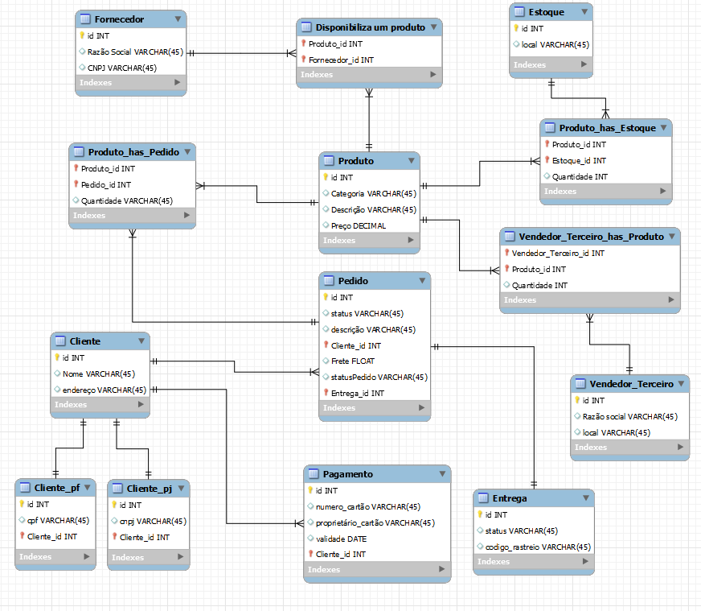

# Modelagem de Banco de Dados E-commerce

### Visão Geral

Este documento descreve a modelagem do banco de dados para um sistema de e-commerce. O objetivo do modelo é organizar e gerenciar informações relacionadas a produtos, clientes (Pessoa Física e Pessoa Jurídica), pedidos, fornecedores, pagamentos e entregas. O modelo foi projetado para garantir flexibilidade, escalabilidade e consistência nos dados.

### Modelo ER

Segue abaixo a imagem representando o modelo relacional do banco de dados:

